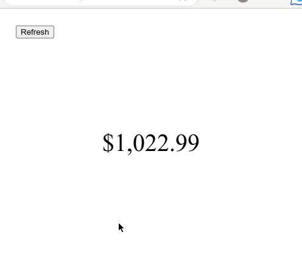

# bank-realtrack
A fastAPI web application that will display the current running transaction total by month.  

## Requirements
- Capital One account. (Any type)
- Email notifications enabled for account.
- Email account with IMAP enabled.

## Banks Supported
- Capital One ([Setup Guide](docs/capital_one.md))
- Truist (Coming Soon)

## Email Setup
- Microsoft Live ([Setup Guide](docs/microsoft_live.md))

## Setup Guide

### Docker

### Direct
